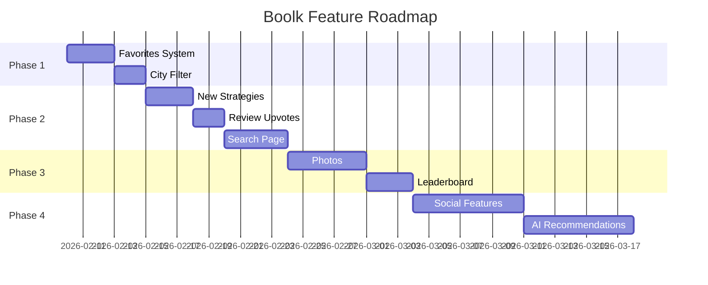

# Research: Feature Expansion Opportunities for Boolk

## Executive Summary

After comprehensive analysis of the Boolk restaurant ranking system, I've identified **10 high-impact feature opportunities** that align with the existing architecture and design patterns. These features expand user engagement, leverage the existing Strategy and Observer patterns, and enhance the core value proposition of the platform.

**Key Recommendation**: Start with **Favorites/Bookmarks** and **City-based Filtering** as they require minimal Firebase cost increase while significantly improving user experience.

---

## Current Architecture Overview

| Component | Current Implementation | Expandable Areas |
|-----------|----------------------|------------------|
| **Models** | RestaurantBase, User, Review | Missing: Favorites, Tags, Photos, Comments |
| **Strategies** | BestValue, Cheapest, MostFilling | Missing: Location-based, Trending, Personalized |
| **Repository** | Full CRUD operations | Missing: Search, Filtering, Pagination |
| **Services** | RestaurantService, UserService | Missing: FavoritesService, SearchService |
| **Pages** | 8 pages (Index, Dashboard, Profile, etc.) | Missing: Search, Favorites, Map, Leaderboard |

---

## Feature Analysis

### 🌟 Tier 1: High Impact, Low Complexity

#### 1. Favorites System

**Description**: Allow users to bookmark restaurants and view them in a dedicated page.

| Aspect | Details |
|--------|---------|
| **Fits Pattern** | Repository Pattern (new `IFavoritesRepository`) |
| **New Model** | `Favorite { UserId, RestaurantId, CreatedAt }` |
| **UI Location** | Profile page, Restaurant cards, New `/favorites` page |
| **Firebase Cost** | Low (small documents, read-heavy) |

**Implementation Scope**:
```csharp
// New Model
public class Favorite
{
    public Guid Id { get; set; }
    public Guid UserId { get; set; }
    public Guid RestaurantId { get; set; }
    public DateTime CreatedAt { get; set; }
}
```

---

#### 2. City-based Filtering

**Description**: Filter restaurants/rankings by city instead of showing all locations.

| Aspect | Details |
|--------|---------|
| **Fits Pattern** | Extends existing Facade and Repository |
| **Implementation** | Add `GetByCityAsync(string city)` to `IRestaurantRepository` |
| **UI Location** | Dropdown on Index, Dashboard, Restaurants pages |
| **Firebase Cost** | Low (uses existing data) |

---

#### 3. Review Upvotes/Helpful Marks

**Description**: Allow users to mark reviews as "helpful" to surface quality feedback.

| Aspect | Details |
|--------|---------|
| **Fits Pattern** | Observer pattern (notify on upvote changes) |
| **Model Change** | Add `HelpfulCount` to `Review` model |
| **UI Location** | Review cards on Restaurant Details page |
| **Firebase Cost** | Low (increment operations) |

---

### 🚀 Tier 2: Medium Complexity, High Value

#### 4. New Ranking Strategies

**Description**: Add more ranking algorithms to the Strategy pattern.

| Strategy | Algorithm | Use Case |
|----------|-----------|----------|
| **TrendingStrategy** | Weight recent reviews higher | Discover rising places |
| **PopularityStrategy** | Rank by review count | Find busy spots |
| **NearbyStrategy** | Filter by city + rank | Location-aware ranking |

**Integration**: Already fits `IRankingStrategy` interface perfectly.

```csharp
public class TrendingStrategy : IRankingStrategy
{
    public List<RestaurantBase> CalculateScore(
        List<RestaurantBase> restaurants, 
        List<Review> reviews)
    {
        // Weight reviews from last 7 days 2x higher
    }
}
```

---

#### 5. Restaurant Photos (Firebase Storage)

**Description**: Allow photo uploads for restaurants and reviews.

| Aspect | Details |
|--------|---------|
| **Technology** | Firebase Storage |
| **Model Change** | Add `PhotoUrls` list to `RestaurantBase`, `Review` |
| **UI Location** | Restaurant Details, Add Review form |
| **Firebase Cost** | Medium (storage costs) |

---

#### 6. Advanced Search

**Description**: Full-text search across restaurant names, cities, and review comments.

| Aspect | Details |
|--------|---------|
| **Options** | A) Client-side filtering B) Algolia integration C) Firebase Extensions |
| **New Page** | `/search` with filters (city, type, price range) |
| **Recommendation** | Start with client-side filtering for simplicity |

---

### 🎯 Tier 3: High Complexity, Premium Features

#### 7. User Leaderboard & Badges

**Description**: Gamification system rewarding active reviewers.

| Badge | Criteria |
|-------|----------|
| 🥉 **Newcomer** | First review |
| 🥈 **Regular** | 10+ reviews |
| 🥇 **Expert** | 50+ reviews |
| 👑 **Top Reviewer** | Top 10 by review count |

**New Page**: `/leaderboard` showing top contributors.

---

#### 8. Social Features

**Description**: Follow users, view their reviews, activity feed.

| Feature | Implementation |
|---------|----------------|
| **Follow Users** | New `Follow { FollowerId, FollowingId }` model |
| **Activity Feed** | Real-time updates via Observer pattern |
| **User Profiles** | Public profile pages `/user/{id}` |

---

#### 9. Restaurant Comparison Tool

**Description**: Side-by-side comparison of 2-3 restaurants.

| Metrics | Display |
|---------|---------|
| Average Price | Bar chart |
| Satiety Score | Star rating |
| Review Count | Number |
| Best Strategy Rank | Position badges |

**UI Location**: Button on restaurant cards, new `/compare` page.

---

#### 10. Personalized Recommendations (Decorator Pattern)

**Description**: AI-powered recommendations based on user's review history.

| Aspect | Details |
|--------|---------|
| **Fits Pattern** | Decorator wrapping existing strategies |
| **Algorithm** | Weight restaurants by type preferences from user reviews |
| **UI** | "Recommended for You" section on Dashboard |

---

## Options Analysis Summary

| Feature | Complexity | Firebase Cost | Pattern Fit | User Value |
|---------|------------|---------------|-------------|------------|
| Favorites | ⭐ Low | 💰 Low | ✅ Repository | ⭐⭐⭐⭐ High |
| City Filter | ⭐ Low | 💰 None | ✅ Facade | ⭐⭐⭐ Medium |
| Review Upvotes | ⭐ Low | 💰 Low | ✅ Observer | ⭐⭐⭐ Medium |
| New Strategies | ⭐⭐ Medium | 💰 None | ✅ Strategy | ⭐⭐⭐⭐ High |
| Photos | ⭐⭐ Medium | 💰💰 Medium | ➕ New | ⭐⭐⭐⭐ High |
| Search | ⭐⭐ Medium | 💰 Low | ➕ New | ⭐⭐⭐⭐ High |
| Leaderboard | ⭐⭐ Medium | 💰 Low | ✅ Repository | ⭐⭐⭐ Medium |
| Social | ⭐⭐⭐ High | 💰💰 Medium | ✅ Observer | ⭐⭐⭐⭐ High |
| Comparison | ⭐⭐ Medium | 💰 None | ➕ New | ⭐⭐⭐ Medium |
| AI Recommendations | ⭐⭐⭐ High | 💰💰💰 High | ✅ Decorator | ⭐⭐⭐⭐⭐ Very High |

---

## Recommended Implementation Roadmap



---

## Detailed Recommendation

### Start with: Favorites + City Filter

**Rationale**:
1. **Low Firebase cost** - Only adds small documents, no storage
2. **High user engagement** - Users can personalize their experience
3. **Pattern-compliant** - Uses existing Repository and Facade patterns
4. **Quick wins** - Achievable in 5-7 days combined
5. **Foundation for future** - Favorites data enables personalization later

### Files to Create/Modify

| Type | File | Changes |
|------|------|---------|
| **[NEW]** | `Models/Favorite.cs` | New model |
| **[NEW]** | `Repositories/Interfaces/IFavoritesRepository.cs` | Interface |
| **[NEW]** | `Repositories/Firebase/FirebaseFavoritesRepository.cs` | Implementation |
| **[NEW]** | `Services/FavoritesService.cs` | Business logic |
| **[NEW]** | `Pages/Favorites.razor` | Favorites page |
| **[MODIFY]** | `Repositories/Interfaces/IRestaurantRepository.cs` | Add `GetByCityAsync` |
| **[MODIFY]** | `Repositories/Firebase/FirebaseRestaurantRepository.cs` | Implement city filter |
| **[MODIFY]** | `Pages/Index.razor` | Add city dropdown, favorite buttons |
| **[MODIFY]** | `Pages/RestaurantDetail.razor` | Add favorite button |
| **[MODIFY]** | `Shared/NavMenu.razor` | Add Favorites link |
| **[MODIFY]** | `Program.cs` | Register new services |

---

## Risk Mitigation

| Risk | Mitigation |
|------|------------|
| Firebase cost increase | Start with low-cost features first |
| Complexity creep | Implement in phases, validate each before moving on |
| Breaking existing patterns | All features designed to extend, not modify, existing patterns |
| Performance issues | Add pagination to new pages from the start |

---

## Conclusion

Boolk has a solid architectural foundation with well-implemented design patterns. The recommended features build upon this foundation rather than requiring architectural changes. The Strategy pattern in particular is underutilized with only 3 strategies—easily expandable to 6+ with trending, popularity, and location-aware rankings.

**Next Steps**:
1. Review this analysis and select priority features
2. Create detailed implementation plans for selected features
3. Use `/feature` workflow for human-in-the-loop implementation
