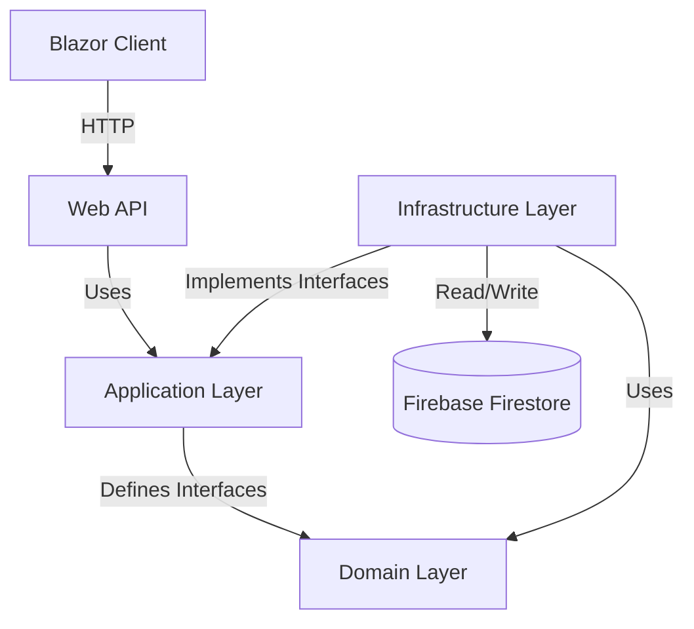

# Boolk - Restaurant Ranking System

A Blazor Server application for ranking restaurants based on user reviews using various strategies.

## Architecture

This project follows **Clean Architecture** principles, ensuring separation of concerns and maintainability.

### System Overview



### Design Patterns Implemented
- **Factory Pattern**: `RestaurantFactory` handles creation of specific restaurant types (`Kebab`, `Pizza`, etc.).
- **Strategy Pattern**: `RankingService` uses interchangeable strategies (`BestValue`, `Cheapest`, `MostFilling`) to calculate rankings dynamically.
- **Repository Pattern**: `RestaurantRepository` and `ReviewRepository` abstract Firebase data access.
- **Dependency Injection**: Extensive use of DI for services and repositories.

## Project Structure

```
src/
├── Boolk.Domain/          # Core entities and logic
│   ├── Entities/          # RestaurantBase, Kebab, Review
│   └── Factories/         # RestaurantFactory
├── Boolk.Application/     # Interfaces and Use Cases
│   ├── Interfaces/        # Service and Repository contracts
│   └── Ranking/           # Strategy pattern definitions
├── Boolk.Infrastructure/  # Implementation details
│   ├── Persistence/       # Firebase repositories
│   └── Services/          # Concrete service implementations
├── Boolk.API/             # REST API endpoints
└── Boolk.Client/          # Blazor WebAssembly/Server UI
```

## Features

- **Restaurant Management**: Add restaurants of different types (FastFood, StudentBar, Premium)
- **Review System**: Add reviews with price, satiety level, and comments
- **Ranking Strategies**:
  - **Best Value**: Ranks by satiety per price ratio
  - **Cheapest**: Ranks by lowest average price
  - **Most Filling**: Ranks by highest average satiety level
- **Live Ranking Calculation**: Rankings are computed on-the-fly based on current data.

## Build & Run

**Prerequisites**: [.NET SDK](https://dotnet.microsoft.com/download)

**Windows (PowerShell):**
```powershell
./run.ps1
```

**macOS / Linux:**
```bash
chmod +x run.sh
./run.sh
```

This builds the solution and starts both the API and the Client.

| Service  | URL                                  |
|----------|--------------------------------------|
| Frontend | http://localhost:5000                 |
| Swagger  | http://localhost:5001/swagger         |

Press `Ctrl+C` to stop both processes.

## Usage

1. **Add Restaurants**: Navigate to `/restaurants` and add new restaurants
2. **Add Reviews**: Navigate to `/reviews` and add reviews for restaurants
3. **View Rankings**: Navigate to `/` (home) and select a ranking strategy to see top restaurants